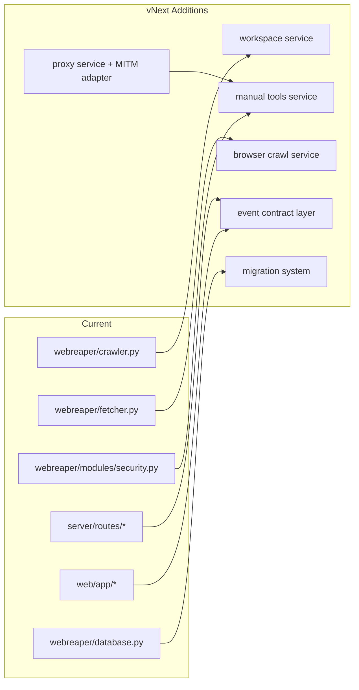

# Feature Design

## Overview

WebReaper vNext will evolve the current monorepo into a unified web intelligence platform with one shared workspace model across crawling, proxy traffic, and security findings. The design keeps the current strengths (Python crawler core, FastAPI backend, Next.js UI, deep extraction work already in local changes) and adds the missing Burp-style primitives through a new proxy/manual-testing subsystem.

Primary design decisions:
- Keep the current monorepo and major runtime stack (Python + FastAPI + Next.js + SQLite/Postgres)
- Introduce a workspace-centric data model and versioned migrations (Alembic)
- Add a browser-rendered crawl pipeline (Playwright worker pool) alongside HTTP crawling
- Add an intercepting proxy subsystem (MITM + traffic history + manual tools) as a first-class backend service
- Normalize all UI event contracts (SSE and WebSocket envelopes) before major feature expansion
- Ship in phases, starting with contract repair + data model + instrumentation, then proxy/manual tools, then active scanning

### Research Findings (used in this design)

- Playwright supports browser-level network observation (`page.on('request'/'response')`) and interception via routing (`page.route(...)`, `browser_context.route(...)`), which fits browser crawl discovery and artifact capture design.
  - https://playwright.dev/python/docs/network
  - https://playwright.dev/python/docs/api/class-browsercontext
- mitmproxy is designed around addon hooks and mutable HTTP flows (`HTTPFlow`), which maps well to interception, history, and Repeater/Intruder integrations.
  - https://docs.mitmproxy.org/stable/addons/overview/
  - https://docs.mitmproxy.org/stable/api/mitmproxy/http.html
  - https://docs.mitmproxy.org/stable/concepts/certificates/
- Alembic supports async SQLAlchemy migration patterns (async engine + `run_sync`) and should replace ad-hoc `create_tables()` schema evolution.
  - https://alembic.sqlalchemy.org/en/latest/cookbook.html#using-asyncio-with-alembic
- FastAPI’s WebSocket testing support (TestClient + `websocket_connect`) informs integration test strategy for chat/proxy live channels.
  - https://fastapi.tiangolo.com/advanced/testing-websockets/

## Architecture

### Target System Architecture

```mermaid
graph TD
    UI[Next.js UI / Tauri Desktop] --> API[FastAPI API Gateway]
    UI --> SSE[SSE Streams]
    UI --> WS[WebSockets]

    API --> ORCH[Job Orchestrator]
    API --> Q[(Job Queue / Task State)]
    API --> DB[(Postgres/SQLite + Alembic)]
    API --> FILES[(Artifact Store)]

    ORCH --> HTTPCRAWL[HTTP Crawl Workers]
    ORCH --> BROWSERCRAWL[Browser Crawl Workers (Playwright)]
    ORCH --> PASSIVE[Passive Scanner]
    ORCH --> ACTIVE[Active Scanner/Fuzzer]
    ORCH --> REPORT[Report Builder]

    API --> PROXYSVC[Proxy Service]
    PROXYSVC --> MITM[MITM Engine + Addons]
    MITM --> HIST[HTTP Transaction Store]
    HIST --> DB

    HTTPCRAWL --> EXTRACT[Deep Extractor]
    BROWSERCRAWL --> EXTRACT
    EXTRACT --> DB
    EXTRACT --> FILES

    ACTIVE --> DB
    PASSIVE --> DB
    REPORT --> DB
    REPORT --> FILES
```

### Incremental Adoption Architecture (from current code)



### Core Architectural Principles

1. Contracts first
   - Standardize REST, SSE, and WS envelopes before adding large features
   - Add typed API schemas in backend and matching TS types in frontend

2. Workspace-first correlation
   - Every crawl, page, request/response, endpoint, and finding must map to `workspace_id`

3. Capture once, analyze many times
   - Persist crawl/proxy artifacts in normalized tables + optional file blobs
   - Derived analytics read from stored data instead of re-fetching

4. Safety by default
   - Active scanning modules disabled unless explicitly enabled per workspace/run profile

5. Phased extensibility
   - Scanner modules, extractors, and exporters implement interfaces and register with a module registry

## Components and Interfaces

### 1) API Gateway and Contract Layer (FastAPI)

Purpose:
- Single backend entry for UI and automation clients
- Validated request/response schemas
- Event contract normalization for SSE and WebSocket

Reuse from current code:
- `server/main.py`
- `server/routes/jobs.py`, `data.py`, `analysis.py`, `security.py`, `stream.py`, `chat.py`

Key changes:
- Introduce `/api/v1/*` routes (keep existing routes with compatibility shims during migration)
- Add shared schemas module (Pydantic) for REST payloads and event envelopes
- Fix current SSE mismatch by using named event listeners on UI and/or a unified `message` envelope
- Fix chat mismatch by normalizing gateway chunks into UI-consumable message/event types

#### Interface: Event Envelope (SSE + WS)

```python
class EventEnvelope(BaseModel):
    type: str              # e.g. metrics.updated, job.progress, chat.token, proxy.flow.captured
    ts: datetime
    workspace_id: str | None = None
    job_id: str | None = None
    payload: dict
```

#### Interface: API Error

```python
class ApiError(BaseModel):
    code: str              # stable machine code
    message: str
    details: dict | None = None
    request_id: str
```

### 2) Workspace Service (new)

Purpose:
- Own target scope, labels, run profiles, risk policies, and module settings
- Correlate data across crawl/proxy/security/reporting

Responsibilities:
- Create/update/archive workspaces
- Scope evaluation (`in_scope`, `out_of_scope`, rule match reason)
- Store saved views and UI preferences (optional phase split)

#### Interface: Scope Evaluation

```python
class ScopeDecision(BaseModel):
    allowed: bool
    reason: str           # host_match | path_excluded | scheme_blocked | wildcard_match
    matched_rule_id: str | None = None
```

### 3) Crawl Orchestrator (refactor of jobs + crawler integration)

Purpose:
- Start/stop/resume crawl runs
- Schedule HTTP and browser workers
- Emit metrics/progress events
- Chain post-processing (deep extract/passive scan/reporting)

Reuse from current code:
- `server/routes/jobs.py`
- `webreaper/crawler.py`
- `webreaper/frontier.py`
- `webreaper/fetcher.py`

Key changes:
- Promote crawl run state into persistent model (`crawl_runs` / `jobs` normalized)
- Add worker capability types: `http`, `browser`
- Emit consistent progress metrics from shared instrumentation hooks

#### Interface: Crawl Worker Adapter

```python
class CrawlWorkerAdapter(Protocol):
    async def fetch_and_extract(self, task: "CrawlTask") -> "PageCaptureResult": ...
```

#### Interface: PageCaptureResult

```python
class PageCaptureResult(BaseModel):
    url: str
    final_url: str
    status_code: int | None
    fetch_mode: str        # http | browser
    response_headers: dict[str, str]
    html: str | None
    dom_html: str | None
    requests_observed: list[dict] = []
    extraction: dict       # DeepPageData-compatible payload
    errors: list[dict] = []
```

### 4) HTTP Crawl Worker (existing core, hardened)

Purpose:
- High-throughput fetching within scope
- Retry, rate limiting, robots handling
- Deep extraction on successful responses

Reuse from current code:
- `webreaper/fetcher.py::StealthFetcher`
- `webreaper/crawler.py` (+ local `deep_extractor` integration)
- `webreaper/modules/robots.py`

Required improvements:
- Persist full link inventory (internal + external + attributes)
- Persist form records and parameters separately for security workflow seeding
- Emit structured metrics (latency, retry counts, bytes, queue depth)
- Store request/response metadata consistently for both HTTP and browser modes

### 5) Browser Crawl Worker (new, Playwright)

Purpose:
- Discover JS-rendered links, routes, forms, and dynamic content
- Capture DOM snapshots and network observations

Design approach:
- Use a dedicated Playwright worker pool process/service (to isolate browser crashes and memory pressure)
- Extract final DOM HTML after page load policy (`domcontentloaded`, `networkidle`, custom timeout)
- Capture page network events for endpoint discovery and seed proxy/scanner workflows

Capabilities mapped to research:
- Network request/response observation via page events
- Request interception controls via page/context routing for optional blocking or instrumentation

#### Interface: Browser Crawl Request

```python
class BrowserCrawlConfig(BaseModel):
    timeout_ms: int
    wait_until: str             # domcontentloaded | load | networkidle
    max_requests_per_page: int
    capture_screenshots: bool = False
    capture_network_bodies: bool = False
    blocked_resource_types: list[str] = []  # image/font/media for speed
```

### 6) Deep Extractor Service (existing local work promoted)

Purpose:
- Parse and normalize on-page data once for SEO, content, and recon use cases

Reuse from current local changes:
- `webreaper/deep_extractor.py`
- `server/routes/analysis.py`
- DB columns in `webreaper/database.py`

Design decision:
- `DeepPageData` becomes the canonical extraction contract and is versioned (e.g. `extraction_schema_version`)
- Extraction failures become component-scoped warnings, not page-level hard failures

Subcomponents (logical, can remain in one file initially):
- metadata extractor
- link/form extractor
- asset extractor
- structured data parser
- contact discovery
- technology fingerprinting
- SEO audit scorer
- content analysis scorer

### 7) Proxy Service (new, Burp-like core)

Purpose:
- Local intercepting proxy for HTTP/HTTPS capture, modification, and history
- Feeds manual tools and active scanning workflows

Design approach:
- Implement `webreaper.proxy` service layer that wraps a MITM engine via addon/hooks
- Persist normalized flow records + bodies/artifacts into WebReaper DB/storage
- Expose control APIs for listener lifecycle, intercept toggles, history filters, and send-to-tool actions

Why service boundary matters:
- Proxy traffic handling has different performance and lifecycle characteristics than crawl jobs
- Easier to run/stop separately in desktop and server deployments

#### Interface: Proxy Listener Control

```python
class ProxyListenerConfig(BaseModel):
    host: str = "127.0.0.1"
    port: int = 8080
    intercept_enabled: bool = False
    tls_intercept_enabled: bool = False
    body_capture_limit_kb: int = 512
    include_hosts: list[str] = []
    exclude_hosts: list[str] = []
```

#### Interface: Captured Flow Event

```python
class CapturedFlow(BaseModel):
    flow_id: str
    workspace_id: str
    request: dict
    response: dict | None
    timing: dict
    tags: list[str] = []
    source: str = "proxy"
```

### 8) Manual Testing Tools Service (new)

Purpose:
- Burp-like Repeater, Intruder, Decoder inside same workspace

Components:
- Repeater: editable request tabs, replay history, response diffing
- Intruder: payload positions, payload sets, rate control, match/extract rules
- Decoder: stateless transforms and JWT parsing

Reuse from current code:
- `webreaper/modules/security.py` payload knowledge and passive checks
- Existing UI data table patterns (`web/app/data/page.tsx`, `web/app/security/page.tsx`)

#### Interface: Repeater Execution

```python
class RepeaterRequest(BaseModel):
    workspace_id: str
    tab_id: str
    raw_http: str | None = None
    method: str | None = None
    url: str | None = None
    headers: dict[str, str] = {}
    body: str | bytes | None = None
    follow_redirects: bool = False
    timeout_ms: int = 10000
```

```python
class RepeaterResponse(BaseModel):
    run_id: str
    status_code: int | None
    duration_ms: int
    response_headers: dict[str, str]
    body_preview: str | None
    body_sha256: str | None
    diff_from_previous: dict | None
    error: dict | None
```

#### Interface: Intruder Job

```python
class IntruderJobConfig(BaseModel):
    workspace_id: str
    base_request_id: str | None = None
    raw_http_template: str
    positions: list[dict]            # offsets or markers
    payload_sets: list[dict]
    concurrency: int = 5
    rate_limit_per_sec: float = 5.0
    stop_conditions: dict = {}
```

### 9) Security Engine (passive + active scanning)

Purpose:
- Produce consistent findings from crawl data, proxy traffic, and direct scans

Reuse from current code:
- `webreaper/modules/security.py` passive checks and early active scan scaffold
- `server/routes/security.py`

Design changes:
- Split engine interfaces:
  - `PassiveAnalyzers` (response/header/body/form inspection)
  - `ActiveCheckModules` (XSS/SQLi/SSRF/etc)
- Findings schema unified regardless of source (`crawl`, `proxy`, `repeater`, `intruder`, `manual`)
- Require workspace policy gate for noisy or destructive checks

#### Interface: Finding Record (canonical)

```python
class FindingRecord(BaseModel):
    id: str
    workspace_id: str
    crawl_id: str | None = None
    page_id: str | None = None
    endpoint_id: str | None = None
    source: str                    # passive | active | manual | proxy
    category: str                  # xss | sqli | cors | secrets | ...
    severity: str                  # info | low | medium | high | critical
    confidence: str                # low | medium | high
    title: str
    evidence: dict
    reproduction_refs: list[str] = []
    remediation: str | None = None
    created_at: datetime
```

### 10) Data/Analytics Query Layer

Purpose:
- Power Data Explorer and reporting with stable, query-focused APIs

Reuse from current code:
- `server/routes/data.py`
- `server/routes/analysis.py` (local uncommitted)

Design changes:
- Preserve split between row-oriented data APIs (`/data`) and aggregated analytics (`/analysis`)
- Add workspace filters to all endpoints
- Version payloads and publish schemas to frontend types
- Materialize heavy aggregates on demand or via background tasks for large crawls

### 11) Frontend Application (Next.js + Tauri)

Purpose:
- Fast, customizable analyst UI with live updates and linked workflows

Reuse from current code:
- Layout/nav and page structure (`web/app/*`)
- Hooks wrappers (`use-api`, `use-websocket`) after contract fixes
- Data Explorer patterns from `web/app/data/page.tsx`

New feature surfaces:
- Proxy tab (history, intercept queue, raw viewer)
- Repeater tab (multi-tab request editor + diffs)
- Intruder tab (job runner/results)
- Findings tab (workspace-wide triage)
- Profiles/Automation tab

Key frontend design decisions:
- Introduce generated/shared types from backend schema (avoid manual drift)
- Use event reducer per workspace/job for SSE/WS state updates
- Persist user UI preferences (column sets, saved filters, theme) per workspace

## Data Models

### Data Model Strategy

- `webreaper/database.py` remains ORM source of truth
- Alembic migrations become mandatory for schema changes
- SQLite is supported for local/desktop; Postgres recommended for larger runs
- Large request/response bodies and binary artifacts may be stored in file/blob store with DB metadata pointers

### Core Entities (new and evolved)

#### Workspace and Profiles

```typescript
interface Workspace {
  id: string;
  name: string;
  description?: string;
  scopeRules: ScopeRule[];
  tags: string[];
  riskPolicy: RiskPolicy;
  createdAt: string;
  updatedAt: string;
  archivedAt?: string;
}

interface RunProfile {
  id: string;
  workspaceId: string;
  name: string;
  crawlConfig: object;
  browserConfig?: object;
  proxyConfig?: object;
  scanConfig?: object;
  automationSteps?: AutomationStep[];
}
```

#### Crawl and Page Capture

- Reuse/extend current `crawls`, `pages`, `links`, `forms`, `assets`, `technologies`
- Add workspace linkage and source mode fields

Proposed additions:
- `crawls.workspace_id`
- `pages.workspace_id`
- `pages.fetch_mode` (`http|browser`)
- `pages.final_url`
- `pages.extraction_schema_version`
- `pages.capture_artifact_refs` (DOM snapshot/screenshot/network log pointers)
- `links.source_page_id`, `target_url`, `anchor_text`, `rel`, `context`, `status_code`, `broken_reason`
- `forms.inputs_json` normalized enough for scanner seeding

#### HTTP Transactions (proxy + repeater + intruder)

```typescript
interface HttpTransaction {
  id: string;
  workspaceId: string;
  source: 'proxy' | 'repeater' | 'intruder' | 'scanner' | 'browser';
  pageId?: string;
  endpointId?: string;
  requestLine: string;
  requestHeaders: Record<string,string>;
  requestBodyRef?: string;
  responseStatus?: number;
  responseHeaders?: Record<string,string>;
  responseBodyRef?: string;
  startedAt: string;
  durationMs?: number;
  tls?: { sni?: string; alpn?: string; certSubject?: string };
  tags: string[];
}
```

#### Endpoint and Parameter Inventory

Purpose:
- Shared substrate for scanner and manual tools

```typescript
interface Endpoint {
  id: string;
  workspaceId: string;
  host: string;
  scheme: 'http' | 'https' | 'ws' | 'wss';
  method: string;
  path: string;
  queryParams: string[];
  bodyParamNames: string[];
  contentTypes: string[];
  firstSeenAt: string;
  lastSeenAt: string;
  sources: string[]; // crawl/proxy/browser/repeater
}
```

#### Findings and Evidence

- Evolve current `security_findings` into canonical finding model with linkage columns
- Add evidence references to transactions/artifacts

Proposed additions:
- `security_findings.workspace_id` (required)
- `security_findings.crawl_id`, `page_id`, `endpoint_id`, `http_transaction_id`
- `security_findings.confidence`
- `security_findings.source`
- `security_findings.evidence_json`, `reproduction_refs_json`
- `security_findings.status` (open/accepted-risk/fixed/false-positive)

#### Manual Tool State

New tables:
- `proxy_sessions`
- `repeater_tabs`
- `repeater_runs`
- `intruder_jobs`
- `intruder_results`
- `saved_requests`
- `decoder_history` (optional, can be client-side first)

### Migration Plan (critical)

1. Introduce Alembic config and baseline migration matching current production schema
2. Add migration for deep extraction columns + `assets` + `technologies`
3. Add migration for workspace and linkage columns
4. Add migration for HTTP transactions and manual tool tables
5. Add compatibility views or API shims for legacy endpoints while frontend transitions

## Error Handling

### Principles

- No silent failures at trust boundaries
- Partial success is acceptable for extraction and analytics, but must be recorded
- User-visible operations return stable machine-readable error codes
- Long-running jobs persist failure state and resume metadata

### Error Handling by Component

#### Crawl/Browser Workers
- Categorize errors: network, timeout, DNS, TLS, parse, scope, storage
- Persist page/capture record even when fetch fails (with error metadata) when feasible
- Retry only idempotent fetch paths and record retry counts

#### Proxy Service
- Listener startup failures return actionable error (port in use, cert missing, permission denied)
- Interception timeout auto-forwards or fails closed based on user policy
- Oversized bodies truncated with explicit flags (`truncated=true`, `capture_limit_kb`)

#### Manual Tools
- Repeater preserves failed attempts and raw error context
- Intruder job records per-attempt result and supports pause/resume/cancel
- Unsafe operations blocked by workspace policy with explicit confirmation requirement

#### API Layer
- Use `ApiError` envelope for non-2xx responses
- Include `request_id` in logs and response for tracing
- Validate request payloads strictly (positions, rate limits, payload counts)

#### UI Layer
- Distinguish transport errors vs empty-state results
- Keep last-known-good live metrics if stream disconnects, show reconnect status
- Surface schema mismatch warnings during compatibility period

## Security and Safety Controls

- Explicit authorization acknowledgement required to enable active testing modules
- Workspace risk policy gates destructive/noisy modules
- Default-safe profiles for passive crawl and passive scan only
- Redaction pipeline for exports (cookies, auth headers, tokens, PII patterns)
- API authentication/RBAC planned for multi-user or remote deployments
- Audit log entries for proxy interception changes, active scan starts, and manual tool actions

## Testing Strategy

### 1) Unit Tests

Backend:
- `DeepExtractor` component tests (metadata, links, JSON-LD, tech fingerprints, SEO scoring)
- `SecurityScanner` passive/active module tests with fixture payloads
- Scope evaluator tests (include/exclude/wildcards)
- Request parser/serializer tests for Repeater/Intruder

Frontend:
- Reducer/state tests for SSE/WS event envelopes
- Table/filter/query param serialization tests
- Decoder utilities tests

### 2) Integration Tests

Backend API:
- FastAPI route tests for `/api/data`, `/api/analysis`, `/api/security`, `/api/v1/proxy/*`, `/api/v1/repeater/*`
- WebSocket tests for chat/proxy live channels using `TestClient.websocket_connect`
- SSE tests for named event handling and payload schema consistency

Database:
- Alembic migration tests (upgrade from baseline DB, downgrade where supported)
- Cross-version compatibility fixtures (older rows missing deep columns)

### 3) End-to-End Tests

- Next.js UI critical flows:
  - create workspace
  - start crawl and view live progress
  - inspect page data and analysis tabs
  - launch passive scan and triage findings
  - proxy history -> send to repeater -> replay request
- Desktop smoke test (Tauri shell launches backend + UI)

### 4) Performance / Benchmark Tests

- Crawl throughput benchmark (static site, medium site, error-heavy site)
- Browser crawl benchmark (SPA route discovery)
- Proxy capture throughput benchmark (requests/sec, body retention on/off)
- UI responsiveness benchmark for large tables (10k/100k rows with filters)

### 5) Security Regression Tests

- Scanner module false-positive/false-negative fixture suites
- Proxy interception policy enforcement tests
- Export redaction tests (auth headers, cookies, tokens)

## Implementation Phasing (recommended)

### Phase A (Stabilize foundation)
- Fix SSE/WS contracts and frontend hooks
- Add shared API schemas/types
- Add Alembic and migrate deep extraction schema
- Link findings to crawl/page/workspace
- Instrument real metrics/progress

### Phase B (Complete crawl/data excellence)
- Browser crawl worker (Playwright)
- Full link/form persistence and endpoint inventory
- Duplicate content, link health, crawl quality analytics
- UI saved views/customization persistence

### Phase C (Burp-like core)
- Proxy listener + traffic history
- HTTPS cert setup UX and status checks
- Repeater MVP (raw request editor + replay + diff)
- Decoder utilities

### Phase D (Advanced security tooling)
- Intruder payload engine
- Active scan modules and policy gating
- Findings/evidence workflows and reporting
- Automation profiles and chained assessments

## Risks and Mitigations

- Proxy/MITM complexity and platform differences
  - Mitigation: service boundary + staged MVP + desktop-first testing matrix
- DB migration risk on existing installs
  - Mitigation: Alembic baseline + backup/validate-before-upgrade + compatibility shims
- Browser crawl resource cost
  - Mitigation: isolated worker pool + per-domain concurrency + resource blocking options
- UI feature sprawl/type drift
  - Mitigation: schema-driven types + event envelope standardization before expansion

## File/Module Impact Plan (initial mapping)

Backend (modify):
- `server/main.py` (router versioning, startup migrations, service wiring)
- `server/routes/jobs.py`, `stream.py`, `chat.py`, `security.py`, `data.py`, `analysis.py`
- `webreaper/crawler.py`, `fetcher.py`, `database.py`, `modules/security.py`

Backend (new):
- `webreaper/workspaces/*`
- `webreaper/browser/*`
- `webreaper/proxy/*`
- `webreaper/manual_tools/*`
- `webreaper/scanners/*` (modular active checks)
- `server/schemas/*` (Pydantic contracts)
- `alembic/` (migrations)

Frontend (modify/new):
- `web/hooks/use-sse.ts`, `web/hooks/use-agent.ts`
- `web/lib/types.ts` (or generated schema types)
- `web/app/data/page.tsx`, `web/app/security/page.tsx`, `web/app/chat/page.tsx`
- new `web/app/proxy/page.tsx`, `web/app/repeater/page.tsx`, `web/app/findings/page.tsx`, `web/app/profiles/page.tsx`

## Open Questions (to resolve in tasks phase, not blockers for design)

- Single-process embedded proxy vs separate subprocess for desktop/server modes (design supports either)
- Artifact storage backend abstraction timing (filesystem-only first vs pluggable object storage)
- Exact RBAC/auth approach for remote multi-user deployments (local desktop can defer auth)

