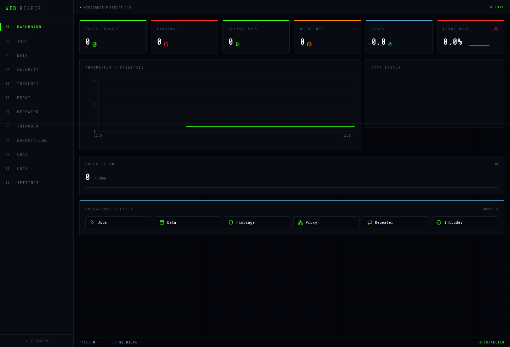
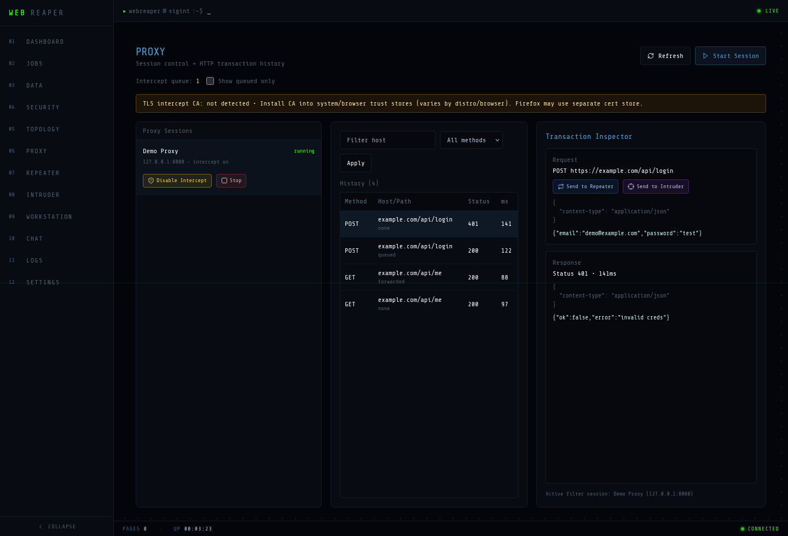
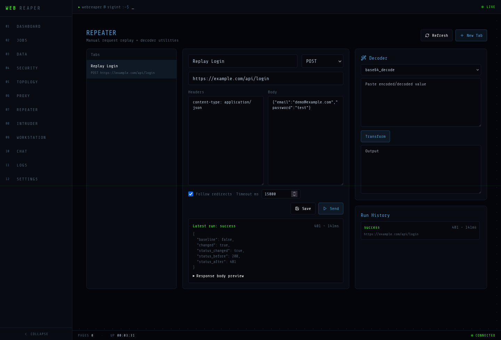
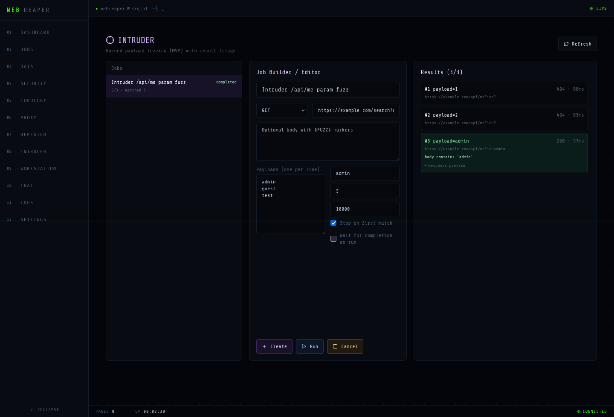
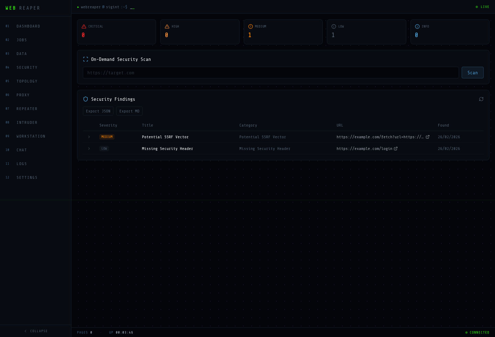

# WebReaper Demo Flow (Local)

This demo shows the current WebReaper vNext stack working across crawl, proxy/manual tools, and findings workflows.

## 0) Start services

```bash
./start.sh
```

- UI: `http://localhost:3000`
- API: `http://localhost:8000`

### Optional: seed demo data (for a deterministic UI demo)

This repo includes a small seed script used to generate the screenshots in this doc.

```bash
export PYTHONPATH=.
export DATABASE_URL='sqlite+aiosqlite:////tmp/webreaper_demo.db'
./.venv/bin/python scripts/seed_demo_data.py

# Demo startup (legacy screenshot mode; bypasses Alembic check on the seeded sqlite DB)
WEBREAPER_DISABLE_MIGRATIONS=1 \
WEBREAPER_LICENSE_SECRET='wr-dev-secret' \
DATABASE_URL='sqlite+aiosqlite:////tmp/webreaper_demo.db' \
./.venv/bin/python -c 'from server.main import start_server; start_server(port=8001)'

# In another shell
cd web
NEXT_PUBLIC_API_URL='http://127.0.0.1:8001' \
NEXT_PUBLIC_WS_URL='ws://127.0.0.1:8001' \
NEXT_PUBLIC_SSE_URL='http://127.0.0.1:8001' \
pnpm dev --port 3000
```

> The screenshot seed data is local/demo-only and safe to regenerate.
> License enforcement is off by default for self-hosted/local runs. Set `WEBREAPER_REQUIRE_LICENSE=1` only if you want to exercise the legacy gated mode.

## 1) Dashboard (ops cockpit)
- Open the dashboard and verify metrics stream updates.
- Use the **Operations Cockpit** quick links to jump into Jobs/Data/Security/Proxy/Repeater/Intruder.



## 2) Proxy (session control + history + intercept)
- Start a proxy session.
- Toggle intercept.
- Review history rows and raw request/response payloads.
- Use queue controls (**forward / edit / drop**) for queued transactions.



## 3) Repeater (manual replay + decoder)
- Open or create a Repeater tab.
- Edit request URL/headers/body.
- Send request and inspect diff summary vs prior run.
- Use Decoder panel for URL/Base64/HTML/hex/JWT parsing.



## 4) Intruder (payload fuzzing MVP)
- Create a job with `§FUZZ§` markers in URL or body.
- Provide payloads (one per line).
- Run job and inspect per-attempt results / match reasons / response previews.



## 5) Security findings (scan + triage + export)
- Run an on-demand scan.
- Expand a finding, update triage status.
- Export JSON or Markdown report.



## Suggested live demo script (5–10 min)
1. Show Dashboard + quick links
2. Start a crawl from Jobs
3. Inspect extracted pages in Data
4. Show Proxy queue + send a request to Repeater / Intruder
5. Run Security scan, triage one finding, export report

## Notes
- Full MITM runtime integration and richer live proxy stream updates are still evolving.
- Screenshots in `output/playwright/` are local artifacts captured via Playwright CLI skill.
